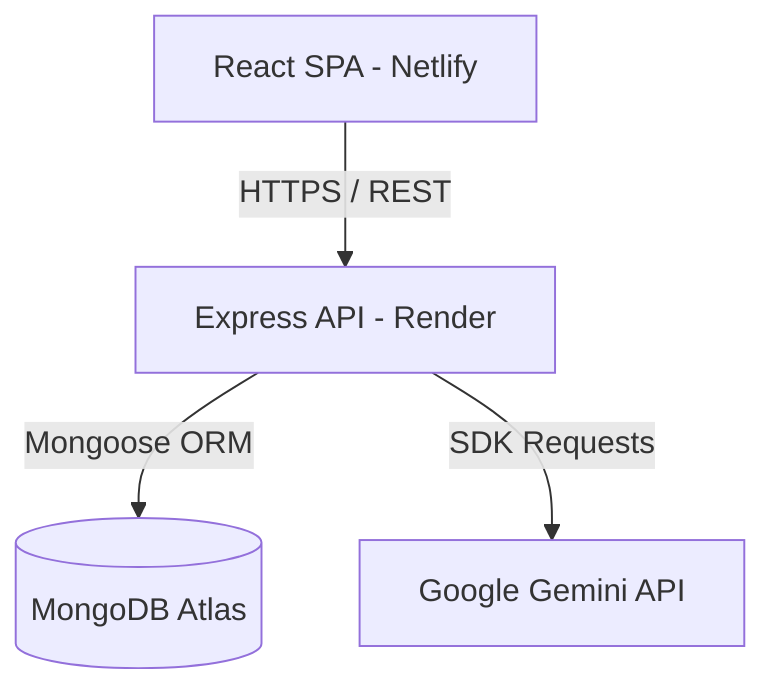

# BuildForge - Intelligent E-Commerce & PC Builder Showcase Platform

BuildForge is an intelligence-driven E-Commerce marketplace and PC customizer platform built on the MERN stack. It empowers users to browse premium hardware components, verify system compatibility in real-time, estimate AAA gaming FPS performance across target resolutions, save configurations locally under user-scoped keys, share rigs with the community, and converse with an AI Hardware Consultant chatbot.

---

## System Architecture



---

## Features

### 1. User & Profile Features
* **JWT Authentication**: Secure login and signup flows with password hashing via `bcryptjs` and token verification.
* **Builder Profiles**: Customizable profiles showing member bios, avatars, default shipping details, order history, and showcase statistics (Reputation, Posts count, Likes received).
* **Isolation & Migration**: User configurations and orders are securely isolated using user-scoped localStorage keys (`forge_saved_builds_${userId}`). Legacy configurations are automatically merged into the user-scoped slot upon login.
* **Order History Tracking**: Detailed tabular logs recording historical procurement orders, itemized prices, checkout status, and transaction timestamps.

### 2. Marketplace & PC Builder
* **Interactive PC Configurator**: Configure custom gaming rigs by selecting compatible parts across 8 hardware slots (CPU, GPU, Motherboard, RAM, Storage, PSU, Cooler, Case).
* **Part Catalog & Faceted Search**: Browse and filter hardware components dynamically by brand, price range, and technical specifications (Socket Type, RAM Support, VRAM, capacity) with responsive URL synchronization.
* **Compatibility Engine**: Automatically validates motherboard-socket pairing, memory type slots, case clearances (maximum GPU length and cooler height), and estimated power consumption wattage.
* **FPS & Resolution Performance Estimator**: Forecasts gaming frame rates (FPS) dynamically at 1080p, 1440p, and 4K resolutions on popular AAA game titles.
* **Shopping Cart & Checkout**: Place procurement orders for parts lists, track checkout shipping information, and log orders directly to user accounts.
* **Side-by-Side Product Comparison**: Compare detailed specifications, socket types, VRAM capacities, and pricing models side-by-side for up to 4 hardware products.

### 3. Community Showcase
* **Build Showcase Feed**: Renders community-shared rigs with author profiles, custom specifications snapshots, and budget metrics.
* **Atomic Interactions**: Users can like, comment, bookmark, and clone community configurations. Likes and comment counters utilize atomic MongoDB operations (`$addToSet`, `$push`, `$pull`, `$inc`) to prevent race conditions.
* **Nested Commenting & Discussion**: Engage in deep dialog threads on custom builds through interactive comment drawers supporting parent-child reply hierarchies.

### 4. AI Consultant Chatbot
* **AI Advisor Dialogue**: Conversational interface powered by Google Gemini (e.g. `gemini-2.5-flash`) that acts as a hardware consultant.
* **Progressive Requirement Gathering**: Inquires about the user's budget, purpose, and preferred brands, cross-referencing live database products to recommend builds.
* **Compatibility Advisor**: Directly analyses selected configurations to explain bottleneck issues and compatibility warnings in plain text.

### 5. UI Presentation & Layout (Stitch & WebGL)
* **Stitch Styling System**: Built using the **Stitch** layout and component styling principles on the frontend for custom components, fluid layouts, and cohesive typography.
* **Dynamic WebGL Background**: Animated WebGL hero layout rendering smooth gradient wave shaders and real-time color transitions.
* **Trending Carousel & Skeletons**: Animated hardware showcases and loading state skeletons to optimize perceived user response times.

---

## Tech Stack

* **Frontend**: Stitch, React (v18+), Vite, Tailwind CSS, Lucide Icons, React Router DOM
* **Backend**: Node.js, Express, Mongoose (v9.x), JWT (jsonwebtoken), Bcryptjs, Cors
* **AI Engine**: Google Generative AI SDK (Gemini AI)
* **Database**: MongoDB (Atlas)
* **Deployment Hosting**: Netlify (Frontend), Render (Backend)

---

## Folder Structure

```
E-Commerce/
├── backend/                  # MVC Backend
│   ├── config/               # Database and server configs
│   ├── controllers/          # Request handlers (auth, products, orders, chat, community)
│   ├── data/                 # Seed datasets and migration scripts
│   ├── middleware/           # Auth, error, and routing interceptors
│   ├── models/               # Mongoose schemas (User, Product, Order, CommunityBuild, Bookmark)
│   ├── routes/               # API endpoint routing declarations
│   ├── services/             # Gemini AI SDK integration
│   ├── utils/                # Token and query features
│   ├── server.js             # Server bootloader entrypoint
│   └── app.js                # Express app configuration
├── public/                   # Frontend static assets (contains _redirects)
├── src/                      # Frontend Source
│   ├── components/           # Reusable UI widgets (Navbar, ChatAssistant)
│   ├── context/              # Cart and global state providers
│   ├── data/                 # Fallback datasets
│   ├── pages/                # Page components (Home, Products, Profile, SavedBuilds, Community)
│   ├── App.jsx               # Client routes setup
│   ├── index.css             # Main styling system
│   └── main.jsx              # DOM renderer and fetch interceptor
├── vite.config.js            # Vite build and proxy settings
├── vercel.json               # Alternative Vercel deployment configs
├── package.json              # Client dependencies and build scripts
└── README.md                 # Project documentation
```

---

## Installation & Setup

### Prerequisites
* Node.js (v18+)
* MongoDB (Local instance or Atlas cloud account URI)

### 1. Database Setup & Seeding
1. Start your local MongoDB server or prepare your MongoDB Atlas URI.
2. Navigate to the `backend/` directory:
   ```bash
   cd backend
   ```


### 2. Backend Server Setup
1. Create a `backend/.env` file based on `backend/.env.example`:
   ```env
   PORT=5000
   NODE_ENV=development
   MONGODB_URI=mongodb://127.0.0.1:27017/ecommerce
   JWT_SECRET=your_super_secure_jwt_secret_key_minimum_256_bits
   JWT_EXPIRES_IN=7d
   GEMINI_API_KEY=your_google_ai_studio_gemini_api_key
   ```
2. Install server dependencies:
   ```bash
   npm install
   ```
3. Boot the API server in development mode:
   ```bash
   npm run dev
   ```

### 3. Frontend Client Setup
1. Open a new terminal in the workspace root directory:
   ```bash
   npm install
   ```
2. Run the Vite development server:
   ```bash
   npm run dev
   ```
3. Open `http://localhost:3000` in your browser.

---

## Environment Variables

### Backend (`backend/.env`)
| Variable | Required | Description | Example |
| :--- | :--- | :--- | :--- |
| `PORT` | No | Binding port for the server (defaults to 5000) | `5000` |
| `NODE_ENV` | Yes | Server environment state | `production` / `development` |
| `MONGODB_URI` | Yes | MongoDB Connection String | `mongodb+srv://...` / `mongodb://...` |
| `JWT_SECRET` | Yes | Secret key used for signing JWT login tokens | `strong_random_secret_string` |
| `JWT_EXPIRES_IN`| Yes | Validity duration of auth tokens | `7d` |
| `GEMINI_API_KEY`| Yes | Google Gemini API key for chatbot advisor | `AIzaSy...` |

### Frontend (`.env` in Root)
| Variable | Required | Description | Example |
| :--- | :--- | :--- | :--- |
| `VITE_API_URL` | No | Base URL of the API server in production | `https://buildforge-backend.onrender.com` |

---

## API Overview

### 1. Authentication (`/api/auth`)
* `POST /register`: Register a new user account.
* `POST /login`: Log in and retrieve a JWT bearer token.

### 2. Marketplace Products (`/api/products`)
* `GET /`: Retrieve catalog products with filters, sorting, keyword search, and dynamic specs matches.
* `GET /categories`: Retrieve all distinct product categories.
* `GET /games`: Retrieve AAA game profiles for FPS calculations.
* `GET /:id`: Retrieve detailed product parameters.
* `POST /` (Admin): Create a new product.
* `PATCH /:id` (Admin): Modify product fields.
* `DELETE /:id` (Admin): Remove product.

### 3. Community Showcase (`/api/community-builds`)
* `GET /`: Retrieve published showcase builds feed.
* `POST /`: Publish a custom build configuration.
* `GET /:id`: Retrieve specific showcase build details.
* `DELETE /:id`: Delete showcase post.
* `POST /:id/like`: Toggle atomic likes.
* `POST /:id/bookmark`: Toggle bookmark tracking.
* `POST /:id/clone`: Increment clone tracking count.
* `GET /:id/comments`: Retrieve comment logs.
* `POST /:id/comments`: Add a new comment/nested reply.
* `DELETE /:id/comments/:commentId`: Remove comment.

### 4. Users (`/api/users`)
* `GET /profile`: Get active user profile with computed reputation.
* `PATCH /profile`: Update profile info.

### 5. Orders (`/api/orders`)
* `POST /`: Submit a procurement order.
* `GET /myorders`: Get logged-in user order history.

### 6. AI Consultation (`/api/chat`)
* `POST /`: Chatbot hardware consultant endpoint.

---


## Production Verification Checklist

- [ ] **Authentication**: Users can sign up, log in, secure JWT token is saved, and protected routes block unauthenticated visitors.
- [ ] **API Connectivity**: Frontend fetches succeed in production environment, fetching database products and saving builds correctly.
- [ ] **Real-time Compatibility**: Builder scans socket mismatch, PSU sufficiency, and case GPU clearances.
- [ ] **AI Advisor Chatbot**: Gemini chatbot replies, analyzes compatibility lists, and identifies concept explanations.
- [ ] **Atomic Counters**: Liking and commenting from concurrent users do not hit VersionError crashes.
- [ ] **Database Integrity**: Saved builds, profiles, and order logs persist correctly in MongoDB Atlas.

---

## License
Distributed under the ISC License. See `LICENSE` for details.
